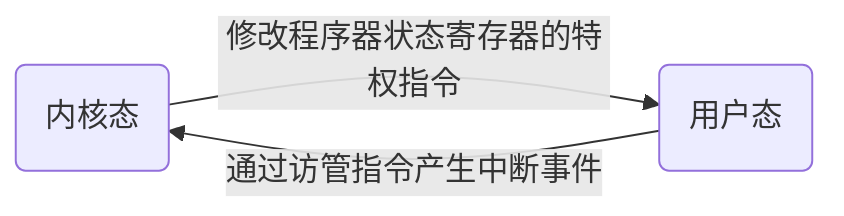
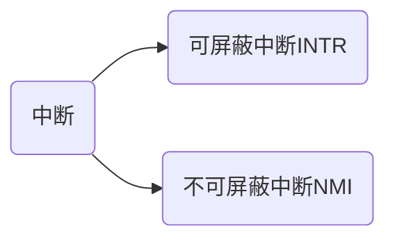
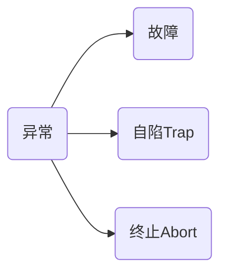

[TOC]

# 操作系统基本概念

## 操作系统的概念

学术界无明确严格的定义，但是可以从不同的角度来理解操作系统

- **从用户角度**：操作系统提供了一个用户友好的界面来方便用户的使用，用户无需考虑复杂的底层系统，而是通过操作系统提供的接口（即系统调用）使用计算机资源.如下图所示,用户可通过三种方式使用计算机,即通过命令方式、系统调用方式和图标-窗口方式来实现与操作系统的通信,并取得它的服务。
  
- **从计算机资源的角度**：操作系统是计算机系统各类软硬件资源的管理者。它通过对计算机资源和底层结构的抽象，将裸机改造成一台拥有扩展功能的计算机。
- **从计算机系统的角度**：操作系统位于用户层和硬件层之间，向上提供服务，向下管理资源，所以操作系统需要协调整个计算机系统的工作，提高系统运行效率，使整个计算机系统高效，安全的进行。
- **操作系统的定义（王道）**:是指控制和管理(操作系统是资源对管理者)整个计算机系统的硬件与软件资源,合理地组织,调度计算机的工作与资源的分配,进而为用户和其他软件提供方便接口与环境的程序集合(向上层提供方便易用的服务).
  - 操作系统是计算机系统中最基本的系统软件(最接近硬件的一层软件).

# 操作系统的发展过程

## 未配置操作系统的计算机系统

### 人工操作方式

- 电子管时代,无操作系统
- 计算机操作是由用户(即程序员)采用人工操作方式直接使用计算机硬件系统,即由程序员将事先己穿孔(对应于程序和数据)的纸带(或卡片)装入纸带输入机(或卡片输入机),再启动它们将程序和数据输入计算机,然后启动计算机运行.当程序运行完毕并取走计算结果之后,才让下一个用户上机.
- 缺点
  - 用户独占全机.此时,计算机及其全部资源只能由上机用户独占.
  - CPU 等待人工操作.当用户进行装带(卡)、卸带(卡)等人工操作时,CPU 及内存等资源是空闲的.

### 脱机输入输出方式

- 该技术是事先将装有用户程序和数据的纸带(或卡片) 装入纸带输入机(或卡片机),在一台外围机的控制下,把纸带(卡片)上的数据(程序)输入到磁带上.当 CPU 需要这些程序和数据时,再从磁带上将其高速地调入内存.
  如下图所示,当 CPU 需要输出时,可由 CPU 直接高速地把数据从内存送到磁带上,然后再在另一台外围机的控制下,将磁带上的结果通过相应的输出设备输出.
  
- 优点
  - 减少了 CPU 的空闲时间(即人工装卸的时间,缓和了人机矛盾)
  - 提高了 IO 速度(需要数据时是直接从高速的磁盘或磁带上将数据掉入内存的,缓和了 IO 设备与 CPU 的矛盾)

## 批处理系统(操作系统开始出现)

用户使用系统提供的作业控制语言来描述自己对作业运行的控制意图,并将这些控制信息连同作业一起交给计算机.

### 单道批处理系统

- **为实现对作业的连续操作,需要先把一批作业以脱机命令方式输入到磁带上,并在系统中配上监督程序,在它的控制下,使这批作业能一个接一个地被连续的处理.** 以写作业为例:

  ```mermaid
    graph TB
    A[写数学作业] --> B{"写化学作业"}
    B --> C[写物理作业]
    C --> D[写生物作业]
  ```

- 单道批处理其流程图为
  
- 单道批处理系统的特征:
  - 自动性.在顺利情况下,在磁带上的一批作业能**自动地逐个**地依次运行,而无需人工干预.
  - 顺序性.磁带上的各道作业是顺序地进入内存,各道作业的完成顺序与它们进入内存的顺序,在正常情况下应完全相同,**亦即先调入内存的作业先完成**.
  - 单道性.内存中仅有一道程序运行,**即监督程序每次从磁带上只调入一道程序进入内存运行,当该程序完成或发生异常情况时,才换入其后继程序进入内存运行**.
- 缺点:系统内资源得不到充分利用.因为内存中只有一个程序.每逢该程序在运行过程中发出 IO 请求后,CPU 便处于等待状态,必须在其 IO 完成后才能继续进行.有因为 IO 设备的低速性,更使 CPU 的利用率显著降低.如下图所示
  

### 多道批处理系统

**在该系统中,用户所提交的作业都先在放在外在上并排成一个队列,称为"后备队列",然后,由作业调度程序按一定的算法从后备队列中选择若干个作业调入内存,使它们共享 CPU 和系统中的各种资源**。由于同时在内存中装有若干个程序,这样便可以在运行程序设计 A 时,利用其因 IO 操作而暂停执行时的 CPU 空档时间,再调度另一个程序 B 运行,同样可以利用程序 B 在 IO 操作时的 CPU 空档时间,再调度程序 C 运行,使多道程序交替运行,这样便可以保持 CPU 处于忙碌状态.


- 多批道系统的特点:**多道,宏观上并行,微观上串行**.
  - 多道:计算机内存中同时存放多道相互独立的程序
  - 宏观上并行:同时进入系统的多道程序都处于运行过程中,即它们先后开始各自的运行,但都没有运行完
  - 微观上串行:内存中的多道程序轮流占有 CPU,交替执行.
  - **因有了多道程序设计技术，才有了现代操作系统的雏形。**
- 多批道系统的优缺点
  - 优点:资源利用率高,多道程序共享计算机资源,从而使各种资源得到充分利用；系统吞吐量大,CPU 和其他资源保持"忙碌"状态.
  - 缺点:用户响应的时间较长；不提供人机交互能力,用户既不能了解自己的程序的运行情况,又不能控制计算机(**无交互能力**).
    > 需要注意的是,在多道程序中，由于进程推进顺序的不可预测性，CPU 会因为正在运行的程序等待 IO 事件而选择另一道程序执行，因此多道程序不具备顺序性。

## 分时系统

- 所谓分时技术,是指把处理器的运行时间分成很短的时间片,按时间片轮流把处理器分配给各联机作业使用.若某个作业在分配给它的时间片内不能完成其计算,则该作业暂时停止运行, 把处理器让给其他作业使用,等待下一轮再继续运行.由于计算机速度很快,作业运行轮转得也很快,因此给每个用户的感觉就像是自己独占一台计算机.
- **分时操作系统是指多个用户通过终端同时共享一台主机**.
- **通过分时技术可以将处理机的运行时间分成很短的时间片，轮流分配给各用户的作业使用。**
- 能够改善响应时间的方式是：采用非抢占式优先级调度，一方面对高优先级的进程能够及时响应，另一方面兼顾低优先级进程不会因为高优先级进程的到来而被抢占，这样设计会有效改善响应时间。
- **分时系统的特征**:
  1. 同时性.同时性也称多路性,指允许多个终端用户同时使用一台计算机,即一台计算机与若干台终端相连接,终端上的这些用户可以同时或基本同时使用计算机.
  2. 交互性.用户能够方便地与系统进行人机对话,即用户通过终端采用人机对话的方式直接控制程序运行,与同程序进行交互.
  3. 独立性.系统中多个用户可以彼此独立地进行操作,互不干扰,单个用户感觉不到别人也在使用这台计算机,好像只有自己单独使用这台计算机一样.
  4. 及时性.用户请求能在很短时间内获得响应.分时系统采用时间片轮转方式使一台计算机同时为多个终端服务,使用户能够对系统的及时响应感到满意.

## 实时系统

实时系统是指系统能及时响应外部事件的请求,在规定时间内完成对该事件的处理,并控制所有实时任务协调一致的运行.

- **硬实时系统:某个动作必须绝对地在规定的时刻(或规定的时间范围)发生**,则称为硬实时系统,如飞行器的飞行自动控制系统,这类系统必须提供绝对保证,让某个特定的动作在规定的时间内完成.
- **软实时系统:能够接受偶尔违反时间规定且不会引起任何永久性的损害**.如飞机订票系统,银行管理系统.

## 网络操作系统和分布式操作系统

- 网络操作系统最主要的特点是**网络中各种资源的共享及各台资源的共享及各台计算机之间的通信**.
- 分布式计算机系统是由多台计算机组成并满足下列条件的系统:系统中任意两台计算机通过通信方式交换信息:系统中的每台计算机都具有同等的地位,即没有主机也没有从机:每台计算机上的资源为所有用户共享:系统中的任意台计算机都可以构成一个子系统,并且还能重构；**任何工作都可以分布在几台计算机上,由它们并行工作、协同完成.用于管理分布式计算机系统的操作系统称为分布式计算机系统.**
- **该系统的主要特点是:分布性和并行性.分布式操作系统与网络操作系统的本质不同是,分布式操作系统中的若干计算机相互协同完成同一任务**.

# <font color="red">操作系统的基本特性</font>

## 并发

- 并发是指两个或多个事件在同一**时间间隔**内发生.
- 在单处理器系统上，并发执行的程序是交替在处理器上运行的。在多处理器系统上，每个处理器都可以处理独立的程序，所以不同处理器上的多个程序便是同时（并行）执行的。
- 并发与并行的区别:注意同一**时间间隔(并发)** 和 **同一时刻(并行)** 的区别.在多道程序环境下,一段时间内, 宏观上有多道程序在同时执行,而在每个时刻,单处理机环境下实际仅能有一道程序执行,因此微观上这些程序仍是分时交替执行的.操作系统的并发性是通过分时得以实现的.
- 并发是并行的特例，程序有并行性则一定是并发的，反之并发活动不一定是并行的

## 共享

### 互斥资源共享

- 系统中的某些资源,如打印机、磁带机,虽然可供多个进程使用,但为使得所打印或记录的结果不致造成混淆,应规定在一段时间内只允许一个进程访问该资源.为此,当进程人访问某个资源时,必须先提出请求,若此时该资源空闲,则系统便将之分配给进程 A 使用,此后有其他进程也要访问该资源时(只要 A 未用完)就必须等待.仅当进程上访问完并释放该资源后,才允许另一个进程对该资源进行访问.我们把这种资源共享方式称为互斥式共享,
- 在一段时间内**只允许一个进程**访问的资源称为**临界资源**.计算机系统中的大多数物理设备及某些软件中所用的栈、变量和表格,都属于临界资源,它们都要求被互斥地共享.

### 同时访问方式

系统中还有另一类资源,这类资源允许在一段时间内由多个进程"同时"访问.这里所说的 "同时"通常是宏观上的,而在微观上,这些进程可能是交替地对该资源进行访问即 "分时共享" 的.可供多个进程"同时"访问的典型资源是磁盘设备,一些用重入码编写的文件也可被"同时" 共享,即允许若干个用户同时访问该文件.

> **并发和共享是操作系统两个最基本的特征,两者之间互为存在的条件**:1.资源共享是以程序的并发为条件的,若系统不允许程序并发执行,则自然不存在资源共享问题；2.若系统不能对资源共享实施有效的管理,则必将影响到程序的并发执行,甚至根本无法并发执行.

## 虚拟

- 虚拟时指把物理上的实体变为若干个逻辑上的对应物.物理实体是真实存在的,而逻辑上对应物是用户感受到的.
- 没有并发就没有虚拟.
- 操作系统利用两种方式实现虚拟技术，即时分复用技术和空分复用技术

### 时分复用技术

> 时分复用技术通过减少处理器和 IO 设备的空闲时间，来提高计算机资源的利用率

- 虚拟处理器技术：虛拟处理器技术是通过多道程序设计技术,采用让多道程序并发执行的方法,来分时使用一个处理器.此时,虽然只有一个处理器,但它能同时为多个用户服务,使每个终端用户都感觉有一个中央处理器(CPU)在专门为它服务.利用多道程序设计技术把一个物理上的 CPU 虚拟为多个逻辑上的 CPU,称为虛拟处理器.
- 虚拟设备技术：可以通过虚拟设备技术将一台物理上的 IO 设备虚拟为多台逻辑上的 IO 设备，每一台逻辑 IO 设备被一个用户所占有，这样的话一个实际的 IO 设备原本作为临界资源，一段时间内只能由一个用户访问，现在可以被多个用户在宏观上同时访问。

### 空分复用技术

空分复用技术是利用存储器的空闲空间区域存放和运行其他的多道程序，以此来提高内存的利用率。

## 异步

由于资源的有限性,多道程序并发执行,进程的执行不是一贯到底的,而是走走停停,以不可预知的速度向前推进.

## 操作系统的目标和功能

- 目标与功能即定义的拓展

### 操作系统的目标

- 方便性:使计算机简单易用
- 有效性:
  - 第一层含义是提高系统资源的利用率
  - 提高系统的吞吐量(单位时间内处理的任务数)
- 可扩充性:为适应计算机硬件,体系结构以及计算机应用发展的要求,操作系统必须具有很好的可扩充性(能够对原有的功能和模块进行修改,具有良好的可扩充性)
- 开放性(兼容性):指系统能遵循世界标准规范,特别是遵循开放系统互连 OSI 国际标准

# <font color="red">操作系统的功能</font>

## 操作系统作为计算机系统资源的管理者

- 计算机系统中的资源归纳起来可以分为四类:处理机资源,存储器,I/O 设备以及文件.因此操作系统主要是对这四种资源进行管理.
  - 处理机管理:在多道程序环境下,处理机的分配和运行都以进程(或线程)为基本单位,因而对处理机的管理可归结为对进程的管理.并发是指在计算机内同时运行多个进程,因此进程何时创建、何时撤销、如何管理、如何避免冲突、合理共享就是进程管理的最主要的任务.**进程管理的主要功能包括进程控制、进程同步、进程通信、死锁处理、处理机调度等.**
  - 存储器管理:存储器管理是为了给多道程序的运行提供良好的环境,方便用户使用及提高内存的利用率.**主要包括内存分配与回收、地址映射、内存保护与共享和内存扩充等功能**.
  - 文件管理:计算机中的信息都是以文件的形式存在的,操作系统中负责文件管理的部分称为文件系统.**文件管理包括文件存储空间的管理、目录管理及文件读写管理和保护等**.
  - 设备管理:设备管理的主要任务是完成用户的 I/O 请求,方便用户使用各种设备,并提高设备的利用率.**主要包括缓冲管理、设备分配、设备处理和虚拟设备等功能**.

## 操作系统作为用户与计算机硬件系统之间的接口

- 操作系统提供的接口主要分为两类:一类是**命令接口**,用户利用这些操作命令来组织和控制作业的执行；另一类是**程序接口**,编程人员可以使用它们来请求操作系统服务.
- **用户可以通过三种方式操作计算机,分别是命令方式,系统调用方式,图标-窗口方式**.
  

### 命令接口

命令接口分为联机命令接口和脱机命令接口

#### 联机命令接口

- 联机命令接口又称交互式命令接口(Windows 中是 cmd，Unix 中是 shell),适用于分时或实时系统的接口.
- "雇主"说一句话,"工人"做一件事,并做出反馈,这就强调了交互性.

#### 脱机命令接口

- 脱机命令接口又称批处理命令接口(Windows 中是后缀为 bat 的文件),适用于批处理系统,它由一组作业控制命令组成.
- 脱机命令接口可以这样理解:"雇主"把要"工人"做的事写在清单上,"工人"按照清单命令逐条完成这些事,这就是批处理.

### 程序接口

程序接口由一组 **系统调用(也称广义指令)** 组成.用户通过在程序中使用这些系统调用来请求操作系统为其提供服务,如使用各种外部设备、申请分配和回收内存及其他各种要求.

## 操作系统实现了对计算机资源的抽象(扩充)

裸机在最里层,其外面是操作系统.操作系统所提供的资源管理功能和方便用户的各种服务功能,将裸机改造成功能更强、使用更方便的机器

# <font color="red">操作系统运行环境</font>

## 内核模式和用户模式

在计算机系统中,计算机需要执行的程序分为两类,一类为操作系统内核程序,一类为用户自编程序.对于操作系统而言,操作系统内核程序是应用程序的管理者,内核程序要执行一些特权指令,处于安全考虑,用户自编程序不能执行这些指令.

> 要为多道程序提供良好的运行环境，仅靠计算机硬件是无法办到的。因此现代操作系统都引入了进程这个概念，进程间的切换无法通过硬件直接实现。所以还需要一层系统软件来对处理器和硬件资源进行抽象改造，这一层系统软件即为**操作系统内核**。内核是一组系统可信的程序模块，运行在内核空间中。操作系统内核代码和数据都运行在内核空间中，这部分内容是被所有程序共享的，操作系统具有对所有硬件的完全访问权限，可以使机器运行任何指令。同时操作系统禁止用户程序直接访问内核空间。
> 所以要想访问内核空间、必须通过操作系统提供的 API 参数去间接执行内核提供的代码，让内核自身来访问，这祥才不会出现内核代码被用户程序随意修改的情况，才能保证操作系统本身和其它程序的稳定性。用户程序调用系统 API 系数称为**系统调用**，一旦发生了系统调用，将暂信用户程序的运行，转而执行内核代码，访问内核空间，这称为内核模式（Kernel Mode），也称为内核态，而应用程序的代码和数据保存在用户空间，当在用户空间执行自己的代码时，称为用户模式（ User Mode），也称为用户态。

一般来说，**操作系统内核有以下几种功能**

1. 资源抽象：屏蔽底层的硬件细节，使应用程序独立于实际使用的物理资源。
2. 资源分配与回收：将抽象资源分配给应用程序，并在适当的时机进行回收。
3. 资源共享：允许进程共享资源，并提供进程同步和互斥机制，以协调多道程序并发执行。

> 常见的事件如系统调用，外部中断和缺页等都是发生在用户态的，进程切换和缺页处理等只能发生在核心态；
> 常见的指令如 trap 指令，跳转指令，数据传送指令和设置断点指令等都在用户态执行
> 所有特权指令如关中断指令，IO 指令等职能在内核态执行。
>
> - <font color="red">特权指令</font>:是指不允许用户直接使用的指令.
> - 常见的特权指令有:
>   - 开/关中断
>   - 进程切换
>   - **存取用于内行保护的寄存器（例如上下限寄存器、基址寄存器、界限寄存器）**
>   - I/O 指令
>   - **清内存指令**
>   - 设置时钟
>   - 设置 PSW 寄存器(程序状态字寄存器)的值
> - <font color="red">非特权指令</font>:是指允许用户直接使用的指令,它不能直接访问系统中的软硬件资源,仅限于访问用户的地址空间,这也是为了防止用户程序对系统造成破坏.

**用户态和内核态的转换的具体实现**:使用程序器状态寄存器将 CPU 运行模式划分为<font color="red">用户态(目态)和核心态(管态,内核态)</font>.当程序器状态寄存器为 0 时,CPU 处于核心态,此时 CPU 可以执行特权指令,切换到用户态的指令也是特权指令.当程序器状态寄存器为 1 时,CPU 处于用户态,此时 CPU 只能执行非特权指令.应用程序运行在用户态,操作系统内核程序运行在核心态.应用程序向操作系统请求服务时通过使用访管指令,从而产生一个中断事件将操作系统转换为核心态.



## <font color="red">操作系统内核的四个内容</font>

### 时钟管理

时钟是计算机中最关键的设备,时钟的第一功能是计时,除此之外通过时钟中断的管理,可以实现进程的切换

### 中断机制

**引入中断技术的初衷是提高多道程序运行环境中 CPU 的利用率**,而且主要是针对外部设备的.例如,键盘或鼠标信息的输入、进程的管理和调度、系统功能的调用、设备驱动、文件访问等,无不依赖于中断机制.可以说,现代操作系统是靠中断驱动的软件.**中断机制中,只有一小部分功能属于内核,它们负责保护和恢复中断现场的信息,转移控制权到相关的处理程序.这样可以减少中断的处理时间,提高系统的并行处理能力.**

### 原语

按层次结构设计的操作系统,底层必然是一些**可被调用的公用小程序**,它们各自完成一个规定的操作.它们的特点如下:

- 处于操作系统的最底层,是最接近硬件的部分.
- **这些程序的运行具有原子性,其操作只能一气呵成(出于系统安全性和便于管理考虑)**.
- 这些程序的运行时间都较短,而且调用频繁.

通常把具有这些特点的程序称为原语(Atomic Operation).定义原语的直接方法是关闭中断, 让其所有动作不可分割地完成后再打开中断.系统中的设备驱动、CPU 切换、进程通信等功能中的部分操作都可定义为原语,使它们成为内核的组成部分.

### 系统控制的数据结构及处理

系统中用来登记状态信息的数据结构很多,如作业控制块、进程控制块(PCB)、设备控制块、各类链表、消息队列、缓冲区、空闲区登记表、内存分配表等.为了实现有效的管理,系统需要一些基本的操作,常见的操作有以下 3 种:

- 进程管理.进程状态管理、进程调度和分派、创建与撤销进程控制块等.
- 存储器管理.存储器的空间分配和回收、内存信息保护程序、代码对换程序等.
- 设备管理.缓冲区管理、设备分配和回收等.
  从上述内容可以了解,核心态指令实际上包括系统调用类指令和一些针对时钟、中断和原语的操作指令.

## <font color="red">中断和异常的概念</font>

中断是让操作系统内核夺回 CPU 使用权的唯一方式

### 中断和异常的定义

Interrupt and Exception are two different concepts but they are similar in a sense that they both cause the CPU to put a stop to the normal flow of execution of instructions in order to execute another program in the kernel space to handle them.

#### 中断

**中断是计算机外部设备或系统内部程序向 CPU 发送的信号**(与当前 CPU 执行的命令无关),要求操作系统干预正在进行的进程.顾名思义,中断就是突然发生的事件,它使正常的指令执行流程停止.它促使操作系统立即采取下一步行动.这些突发事件通常与 I/O 设备有关,I/O 设备主要与外部世界打交道.例如,当按下键盘上的一个键或移动鼠标时,会触发硬件中断,导致 CPU 读取按键或鼠标的移动.因此,当中断发生时,CPU 会运行一个特殊的 "中断处理例程 "或 "中断处理程序 "来处理首先引起中断的事件.中断发生后,控制权会立即转移到操作系统,促使其立即采取行动.**中断是有优先级的,这意味着具有高优先级的中断需要立即关注并首先处理**.

- 常见中断
  1. 硬件问题,例如打印机卡纸
  2. 用户按键,例如`CTRL ALT DEL`
  3. 软件错误
  4. 电话呼叫(移动设备)
  5. 指示已准备好接收更多数据的磁盘驱动器
  6. 网络数据包到达

#### 异常

异常是异常事件的缩写,是指系统、处理器或程序中某处需要 CPU 注意的意外事件.**异常与 CPU 正在执行的指令密切相关.即：异常会中断正常的指令流,但在程序执行期间发生异常且无法在程序本身内处理**.例如,如果命令处理器将数字除以零,它将给出被零除异常,导致计算机停止计算或显示错误消息.发生异常时,CPU 会中断正在进行的进程,并通过调用特定的异常处理程序函数立即响应异常,具体取决于执行类型.**异常通常可分为处理器检测到的异常和编程的异常.前者发生在 CPU 在执行指令时检测到任何类型的异常时,而后者是根据程序员的请求生成的.**

- 常见异常
  1. 算数溢出
  2. 除零
  3. 取数奇偶校验错
  4. **trap 指令(system call)**
  5. 硬件改变 cpu 执行流程
  6. 地址越界
  7. 页错误/故障
  8. 保护性异常(写仅读内存)
  9. 断点指令

### 中断和异常的分类

#### 中断的分类

- 外中断可分为可屏蔽中断和不可屏蔽中断.
  - 可屏蔽中断是指通过 INTR 线发出的中断请求,通过改变屏蔽字可以实现多重中断,从而使得中断处理更加灵活.**可屏蔽中断主要来自于 IO 设备的中断请求**。
  - 不可屏蔽中断是指通过 NMI 线发出的中断请求,通常是紧急的硬件故障,如电源掉电等.**不可屏蔽中断主要来自于非常紧急的硬件故障**。



#### 异常的分类

- 异常可分为故障、自陷和终止.
  - 故障(Fault)是一种可能恢复的异常事件，若当前指令执行产生故障，CPU 转到故障处理程序进行修复。若可以修复，则 CPU 转到引起故障的指令继续执行。若不能修复，则终止当前进程。常见的操作有非法操作码、 缺页故障、除数为 0、运算溢出等.
  - **自陷(Trap)是一种事先安排的"异常"事件，trap 最重要的用途是在用户程序和操作系统内核之间提供一个接口，即为系统调用。trap 指令也称访管指令，陷入指令，一般用于请求操作系统服务，当陷阱发生后，CPU 转到对应的内核程序执行，执行结束后再返回到用户程序的下一条指令继续执行。**
  - 终止(Abort)是指出现了使得 CPU 无法继续执行的硬件故障,终止是一种无法恢复的异常事件,如内存损坏引起的奇偶校验错误，控制器出错、存储器校验错等.故障异常和自陷异常属于软件中断(程序性异常),终止异常和外部中断属于硬件中断.当终止事件发送后，终止处理程序会调用 `abort` 例程终止应用程序。



### 中断和异常的处理过程

#### 中断响应过程

当 CPU 检测到未被屏蔽的中断请求信号时，进入中断响应阶段，这一阶段由硬件自动完成。
中断响应主要有三个阶段，分别是：关中断，保存断点和程序状态字，引出中断服务程序。

1. 关中断：CPU 首先要关中断，禁止在进行中断处理时又去响应行的中断，防止保存的断点，程序状态字
2. 保存断点和程序状态字：断点就是程序的返回地址，程序状态字是一个进程产生的各种状态信息。断点和程序状态字信息在特殊的寄存器中(PC 和 PSW)，**CPU 会将这两个寄存器内容压栈，以便后续恢复被中断进程的执行流和状态**。这两个寄存器的值由中断隐指令保存，不由操作系统保存。
3. 引出中断服务程序：CPU 检测到中断信号后对具体中断源进行识别，以此引出对应的中断服务程序。

#### 中断处理过程

中断处理阶段主要有三个步骤，保护现场，执行中断处理程序，恢复现场。


**中断响应过程是由硬件自动完成的，当 CPU 完成最后一步：引出中断服务程序后，CPU 控制权交由操作系统，通过执行操作系统提供的中断服务程序完成中断处理过程。**

当中断服务程序执行完毕时，恢复现场通用寄存器信息，开中断，恢复 PC 和 PSW 的信息，使得被中断进程完全恢复原来的状态,中断处理结束。

### 中断与异常小结

|        分类        | 中断                                                             | 异常                                                                  |
| :----------------: | :--------------------------------------------------------------- | --------------------------------------------------------------------- |
|      产生地点      | 处理器外部，由与运行程序无关的中断信号触发，中断时间系统无法得知 | 处理器内部，CPU 控制单元产生                                          |
|     能否被屏蔽     | 高优先级的中断可以屏蔽低优先级的中断                             | 不可被屏蔽                                                            |
| 处理程序是否被阻塞 | 不能被阻塞，处理器需要及时响应其它中断信号                       | 可以被阻塞                                                            |
|        CPU         | 中断与 CPU 异步，无论处理器处于什么状态都需处理外部中断请求      | 异常与 CPU 同步，基本上发生在用户态，内核态唯一发生的异常是"缺页异常" |
|      能否嵌套      | 允许嵌套，一般不超过 3 重，重数多了影响系统性能                  | 大多为一重                                                            |
|   彼此之间的影响   | 中断过程中绝不会产生异常                                         | 异常处理过程中可能会产生中断                                          |

---

| 类型 | 产生原因           | 同步/异步 | 返回             |
| ---- | ------------------ | --------- | ---------------- |
| 中断 | IO 设备的请求信号  | 异步      | 返回下一条指令   |
| 故障 | 可能恢复的异常事件 | 同步      | 可能返回当前指令 |
| trap | 有意安排的异常事件 | 同步      | 返回下一条指令   |
| 终止 | 无法恢复的异常事件 | 同步      | 不会返回         |

## <font color="red">系统调用</font>

所谓系统调用,是指用户在程序中调用操作系统所提供的一些子功能,系统调用可视为特殊的公共子程序.**系统中的各种共享资源都由操作系统统一掌管,因此在用户程序中,凡是与资源有关的操作(如存储分配、进行 IO 传输及管理文件等),都必须通过系统调用方式向操作系统提出服务请求,并由==操作系统代为完成==**.通常,一个操作系统提供的系统调用命令有几十条乃至上百条之多.这些系统调用按功能大致可分为如下几类:

- 设备管理:完成设备的请求或释放,以及设备启动等功能
- 文件管理:完成文件等读写创建及删除等功能
- 进程管理:完成进程的创建,撤销,阻塞及唤醒等功能
- 进程通信:完成进程之间的消息传递或信号传递等功能
- 内存管理:完成内存的分配,回收以及获取作业占用内存区大小及始址功能

可以看出系统调用相关功能涉及系统资源管理,进程管理之类的操作,对操作系统的影响非常大,因此某些操作就必须使用特权指令才能完成.所以<font color="red">系统调用的处理需要由操作系统内核程序负责完成,要运行在核心态.用户程序可以执行陷入指令(又称访管指令或 trap 指令)来发起系统调用,请求操作系统提供服务.用户程序执行"陷入指令",相当于把 CPU 的使用权主动交给操作系统内核程序(CPU 状态会从用户态进入核心态),之后操作系统内核程序再对系统调用请求做出相应处理.处理完成后,操作系统内核程序又会把 CPU 的使用权还给用户程序(即 CPU 状态会从核心态回到用户态)</font>.这么设计的目的是:用户程序不能直接执行对系统影响非常大的操作,必须通过系统调用的方式请求操作系统代为执行,以便保证系统的稳定性和安全性,防止用户程序随意更改或访问重要的系统资源,影响其他进程的运行.

综上执行系统调用的过程主要包括如下操作：

1. 传递系统调用参数
2. 执行 trap 指令
3. 执行响应的服务程序
4. 返回用户态

> 陷阱机制除了可以实现系统调用、还可以实现程序调试的功能。以单步调试为例，将 CPU 设为单步调试状态后，每一条指令都会变成陷阱指令，因此，执行每条指令都会触发陷阱并将控制流转移到一个异常处理程序，该程序的功能就是将当前指令执行结果输出。

> 系统调用（system call）和库函数调用(Library function call)的区别
> 理解库函数的区别和系统调用，首先是 kernel mode 和 user mode 这两个模式是这两种函数工作时的空间不同。
> **系统调用：系统调用实际上是指底层的一个调用，就是内核提供的、功能十分强大的一系列的函数。这些系统调用是在内核中实现的。是操作系统为用户态运行的进程和硬件设备（如 CPU、磁盘、打印机等）进行交互提供的一组接口，即就是设置在应用程序和硬件设备之间的一个接口层。可以说是操作系统留给用户程序的一个接口**。
> 例如 linux 内核是单内核，结构紧凑，执行速度快，各个模块之间是直接调用的关系。放眼整个 linux 系统，从上到下依次是：用户进程->系统调用接口->linux 内核子系统->硬件。linux 内核包括了系统调用接口和内核子系统两部分。或者从下到上：物理硬件->OS 内核->OS 服务->应用程序。这里的 OS 起到了“承上启下”的关键作用，向下管理物理硬件，向上为操作系统服务和应用程序提供接口，这里的接口就是系统调用了。操作系统提供的少部分系统调用都是由 C 和汇编混合编写实现的，其接口用 C 来定义，具体实现则是汇编，这样的好处是执行效率高，而且极大的方便了上层的调用。
> 在 linux 程序设计就是底层调用的意思，面向的是硬件。例如 open，read，read 等都是用于底层文件的访问（low-level file access），例如在驱动程序中对文件的直接访问；系统调用是操作系统相关的，因此一般没有跨操作系统的可移植性；系统调用发生在内核空间，因此如果用户在用户空间的一般应用程序中使用系统调用来进行文件的操作，会有用户空间到内核空间的切换开销。
> **事实上，即使在用户空间是用库函数来对文件进行操作，必然会引起系统的调用，因为文件总是存储在介质上的，不管是读还是写，都是对硬件存储器的操做，必然引起系统调用。例如 C 库函数 fwrite 和 fread 就是通过 read 和 write 系统函数来实现的。**这样的话，使用库函数也有系统调用的开销，为什么不直接使用系统调用呢?这是因为读写文件通常是大量的数据(这种大量是相对于底层驱动的系统调用所实现的数据操作单位而言)，这时，**使用库函数就可以大大减少系统调用的次数（系统调用是一种中断服务机制，需要提出申请占用 CPU 或某些资源来对硬件访问与操做，如 I/O 操作，文件的读取更新等）。这一结果又缘于缓冲区技术。在用户空间和内核空间，对文件操作都使用了缓冲区，例如用 fwrite 写文件，都是先将内容写到用户空间缓冲区，当用户空间缓冲区满或者写操作结束时，才将用户缓冲区的内容写到内核缓冲区**.同样的道理，当内核缓冲区满或写结束时才将内核缓冲区内容写到文件对应的硬件媒介。

# 操作系统结构设计

## 分层法


分层法将 OS 分为若干层,最底层为硬件,最高层是用户接口.每层只能调用紧邻它的低层的功能和服务(单向依赖).

- 优点:便于调试、扩充和维护,提高正确性
- 缺点:定义层次比较困难,运行效率较低

## 模块化


- 模块化是将操作系统按功能划分为若干具有 一定独立性的模块.每个模块具有某方面的管理功能,并规定好各模块间的接又,使各模块之间能够通过接又进行通信.
- 如果将模块划分得太小,虽然能降低模块本身的复杂性,但会使得模块之间的联系过多,造成系统比较混乱;如果模块划分得过大,又会增加模块内部的复杂性
- 优点:提高正确性、可维护性、适应性和开发速度
- 缺点:模块间接口定义可能不完善,混乱

## 宏内核

- 宏内核是一种传统的内核结构，它将进程管理，内存管理，文件系统，驱动，网络协议等各项功能都放到内核中去，将内核从整体上作为一个大过程实现，所有内核服务和用户服务都运行在相同的地址空间。
- 优点:性能高,模块间信息共享
- 缺点:系统复杂度高,不易扩展

## 微内核

- 微内核技术是对内核进行模块化，提供操作系统核心功能的内核的精简版本。这种方法构造的操作系统只保留基本功能，所以内核较小。通常微内核至少会提供基本的进程与内存管理以及通信功能。微内核中用户服务和内核服务在不同的地址空间中实现。
- 优点:便于扩展操作系统,提供了更好的安全性和可靠性,支持分布式
- 缺点:系统性能较差,因为需要频繁地在核心态和用户态之间进行切换，操作 系统的执行开销偏大.为了改善运行效率，可以将那些频繁使用的系统服务移回内核，从而保证 系统性能，但这又会使微内核的容量明显地增大

## 外核

外核是运行在内核态中的一种程序，该程序主要的任务是为虚拟机分配资源。不进行完整的虚拟化,而是将硬件资源直接分配给每个虚拟机。每个虚拟机可以运行自己的操作系统和代码。

- 优点:
  - 减少了资源映射复杂度,外核只需记录资源分配情况
  - 将多道程序和用户操作系统代码分离,减轻负载
  - 提高资源利用效率
- 缺点:
  - 虚拟机无法感知完整的系统环境
  - 资源分配不当可能导致浪费
  - 虚拟机 OS 需要修改以适应资源访问模型
  - 安全隔离不如完全虚拟化

总而言之,外核通过资源分区而不是完全虚拟化来实现多道程序.它减少了虚拟化的复杂度,但也限制了虚拟机的透明性.需要权衡不同应用的虚拟化需求来决定采用外核或完全虚拟化

# <font color="red">操作系统引导</font>

## BIOS 的引导流程

以 windows 操作系统为例,其磁盘构成为下图所示


1. **CPU 激活,读取 BIOS**
   当开机按键被按下后,给 CPU 供电,CPU 被激活,并开始读取 BIOS(基本输入输出系统)程序.**BIOS(Basic Input/Output System)存储在 ROM(read-only memory)或 FLASH 中(不会随着断电而丢失,现在大多在 Falsh 中)**.
2. **硬件自检(Power-On Self-Test)**
   **BIOS 会进行硬件自检,检查 RAM、硬盘等硬件组件是否工作正常**.如果出现故障,会发出报警声音,如无故障，屏幕会显示 CPU、内存、硬盘等信息.
3. **加载启动设备 BIOS 根据设定的启动顺序(Boot Sequence).硬件自检完成后，BIOS 把控制权转交给下一阶段的启动程序."下一阶段的启动程序"具体存放在哪一个设备，通过 CMOS 里保存的启动顺序,或者通过与用户交互的方式，把控制权交给启动顺序排在第一位的存储设备,然后 CPU 将该存储设备引导扇区的内容加载到内存中**,例如硬盘.
   
4. **读取 MBR(Master boot record，缩写为 MBR)**
   BIOS 按照"启动顺序"，把控制权转交给排在第一位的储存设备(在上图中是存放在 CMOS 中).这时，计算机读取该设备的第一个扇区，也就是读取最前面的 512 个字节.如果这 512 个字节的最后两个字节是 0x55 和 0xAA，表明这个设备可以用于启动；如果不是，表明设备不能用于启动，控制权于是被转交给"启动顺序"中的下一个设备.这最前面的 512 个字节，就叫做"主引导记录"(Master boot record，缩写为 MBR).
   > **主引导记录的结构,"主引导记录"只有 512 个字节，放不了太多东西.它的主要作用是，告诉计算机到硬盘的哪一个位置去找操作系统**.主引导记录由三个部分组成:(1)第 1-446 字节：调用操作系统的机器码.(2)第 447-510 字节: **分区表(Partition table)**.(3)第 511-512 字节：主引导记录签名(0x55 和 0xAA).
   > 
5. **根据分区表找到启动分区**.分区表的长度只有 64 个字节，里面又分成四项，每项 16 个字节.所以，一个硬盘最多只能分四个一级分区，又叫做"主分区".每个主分区的 16 个字节，由 6 个部分组成：
   > (1)第 1 个字节：如果为 0x80，就表示该主分区是激活分区，控制权要转交给这个分区.四个主分区里面只能有一个是激活的.(2)第 2-4 个字节：主分区第一个扇区的物理位置(柱面、磁头、扇区号等等).(3) 第 5 个字节：主分区类型.(4) 第 6-8 个字节：主分区最后一个扇区的物理位置.(5) 第 9-12 字节：该主分区第一个扇区的逻辑地址.(6) 第 13-16 字节：主分区的扇区总数.
   
6. **加载分区引导记录 PBR**.读取活动分区的第一个扇区，这个扇区称为分区引导记录(PBR),**其作用是寻找并激活分区根目录下用于引导操作系统的程序(启动管理器)**.
7. **加载启动管理器(Boot loader)**.计算机读取"主引导记录"前面 446 字节的机器码之后，不再把控制权转交给某一个分区，而是运行事先安装的"启动管理器"(boot loader)，由用户选择启动哪一个操作系统.
8. **加载操作系统.控制权转交给操作系统后，操作系统的内核首先被载入内存**.

## EFI 的引导流程
//TODO 待补充
# 虚拟机

虚拟机是一台逻辑计算机,是指利用特殊的虚拟化技术,通过隐藏特定计算平台的实际物理特性,为用户提供抽象的、统一的、模拟的计算环境.有两类虚拟化方法.

## 第一类虚拟机

从技术上讲,第一类虚拟机管理程序就像一个操作系统,因为它是唯一一个运行在最高特权级的程序.它在裸机上运行并且具备多道程序功能.虚拟机管理程序向上层提供若干台虚拟机, 这些虚拟机是裸机硬件的精确复制品.由于每台虚拟机都与裸机相同,所以在不同的虚拟机上可以运行任何不同的操作系统.
虚拟机作为用户态的一个进程运行,不允许执行敏感指令.然而,虚拟机上的操作系统认为自己运行在内核态(实际上不是),称为**虚拟内核态**.虚拟机中的用户进程认为自己运行在用户态(实际上确实是).当虚拟机操作系统执行了一条 CPU 处于内核态才允许执行的指令时,会陷入虚拟机管理程序.在支持虚拟化的 CPU 上,虚拟机管理程序检查这条指令是由虚拟机中的操作系统执行的还是由用户程序执行的.如果是前者,虚拟机管理程序将安排这条指令功能的正确执行.否则,虚拟机管理程序将模拟真实硬件面对用户态执行敏感指令时的行为.

在过去不支持虚拟化的 CPU 上,真实硬件不会直接执行虚拟机中的敏感指令,这些敏感指令被转为对虚拟机管理程序的调用,由虚拟机管理程序模拟这些指令的功能.
](<https://yjc-figure.oss-cn-beijing.aliyuncs.com/.png>)

## 第二类虚拟机

它是一个依赖于 Windows、 Linux 等操作系统分配和调度资源的程序,很像一个普通的进程.第二类虚拟机管理程序仍然伪装成具有 CPU 和各种设备的完整计算机.VMware Workstation 是首个 x86 平台上的第二类虚拟机管理程序.

运行在两类虚拟机管理程序上的操作系统都称为容户操作系统.对于第二类虚拟机管理程序,运行在底层硬件上的操作系统称为宿主操作系统.


## 二者的区别


