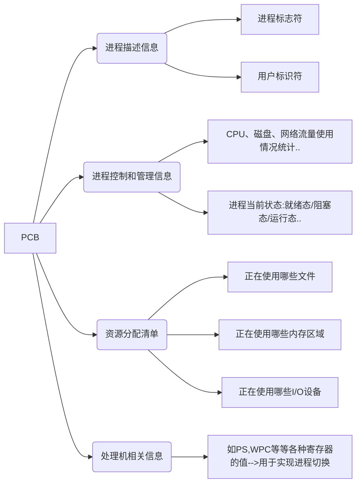

[TOC]

# 进程与线程

## 前驱图和程序执行

### 前驱图

- 前驱图:是指一个有向无循环图,可记为 DAG(Directed Acycli Graph),用于描述进程之间执行的先后顺序.图中的每个结点可用来表示一个进程或程序段,乃至一个语句,结点间的有向边则表示两个结点之间存在的偏序或前驱关系.
- 进程之间的前驱关系可用 $\to$ 来表示.如果进程$P_i$或$P_j$存在前驱关系,则可表示为$P_j \to P_j$,表示$P_j$必须在$P_i$开始执行之前完成.此时$P_i$是$P_j$的直接前趋,$P_j$是$P_i$的直接后继.
- 每个结点还应该有一个重量,用于表示该结点所含有的程序量或程序的执行时间.
  
  上图的前驱关系可以表示为
  $\quad P_1 \to P_2$,$\quad P_1 \to P_3$,$\quad P_1 \to P_4$,$\quad P_2 \to P_5$,$\quad P_3 \to P_5$,$\quad P_4 \to P_6$,$\quad P_4 \to P_7$,$\quad P_5 \to P_8$,$\quad P_6 \to P_8$,$\quad P_8 \to P_9$

### 程序的顺序执行

- 程序的顺序执行:⼀个程序由若⼲个程序段组成,⽽这些程序段的执⾏必须是顺序的,这种程序执⾏的⽅式就称为程序的顺序执⾏
- **程序顺序执行时的特征**
  - 顺序性:处理机的操作严格按照程序所规定的顺序执⾏
  - 封闭性:程序⼀旦开始执⾏,其计算结果不受外界因素的影响
  - 可再现性:程序执⾏的结果与它的执⾏速度⽆关(即与时间⽆关),⽽只与初始条件有关

### 程序的并发执行


一般来说,输入程序 $(I_{i+1})$ 在输入第 $i+1$ 个程序时,计算程序 $(C_i)$ 可能正在对第$i$个程序进行计算,而打印程序正在打印第 $i-1$ 个程序的计算结果.图示表示了输入、计算和打印这三个程序对一批作业进行处理的情况.那么该例中存在下述的前趋关系(其中$I$为输入,$C$为计算,$P$为打印):

$$
\mathrm{I_i\to C_i,~I_i\to I_{i+1},~C_i\to P_i,~C_i\to C_{i+1},~P_i\to P_{i+1}}
$$

### **程序并发执行时的特征**

- 间断性:程序在并发执行时,由于它们共享系统资源,以及为完成同一项任务而相互合作,致使在这些并发执行的程序之间形成了相互制约的关系.例如在上面的例子中 I,C,P 是三个相互合作的程序,它们之间存在"执行--暂停--执行"
- 失去封闭性:程序在并发执⾏时,系统的资源状态由多道程序来改变,程序运⾏失去封闭性.程序的运⾏受到其他程序的影响.
- 不可再现性:程序在并发执⾏时,多次运⾏初始条件相同的同⼀程序会得出不同的运⾏结果.例:共享公共变量的两个程序,它们执⾏时可能产⽣不同结果.

需要注意的是,此时出现这些问题是因为没有引进进程这一概念.

## 进程

进程是一个独立的运行单位,也是操作系统进行资源分配和调度的基本单位

### 进程的组成

PCB 是提供给操作系统用的,程序段和数据段是给进程自己用的.相应地,**由程序段、相关数据段和 PCB 三部分构成了进程实体(又称进程映像)**

#### <font color="red">PCB</font>

为了使参与并发执行的每个程序(含数据)都能独立地运行,必须为之配置一个专门的数据结构,称为**进程控制块**(Process Control Block, PCB).**系统利用 PCB 来描述进程的基本情况和运行状态,进而控制和管理进程**.所谓**创建进程,实质上是创建进程实体中的 PCB**;而撤销进程,实质上是撤销进程的 PCB.

> PCB 是进程存在的唯一标志.

##### 进程控制块的作用

1. 作为独立运行基本单位的标志.
2. 能实现间断性运行方式.在多道程序环境下,程序是采用停停走走间断性的运行方式运行的.
3. 提供进程管理所需要的信息
4. 提供进程调度所需要的信息
5. 实现与其他进程的同步与通信.

##### PCB 中包含的信息

进程控制块操作系统需要对各个并发运行的进程进行管理,但凡管理时所需要的信息,都会被放在 PCB 中



---

以下为具体内容
| 进程描述信息 | 进程控制和管理信息 | 资源分配清单 | 处理机相关信息 |
| --------------- | ------------------ | ------------ | -------------- |
| 进程标识符(PID) | 进程当前状态 | 代码段指针 | 通用寄存器值 |
| 用户标识符(UID) | 进程优先级 | 数据段指针 | 地址寄存器 |
| | 代码运行入口地址 | 堆栈段指针 | 控制寄存器值 |
| | 程序的外存地址 | 文件描述符 | 标志寄存器值 |
| | 进入内存时间 | 键盘 | 状态字 |
| | 处理机占用时间 | 鼠标 | |
| | 信号量使用 | | |

##### PCB 的组织方式

在一个系统中,通常可拥有数十个、数百个乃至数干个 PCB.为了能对它们加以有效的管理,应该用适当的方式将这些 PCB 组织起来.

- 线性方式:即将系统中所有的 PCB 都组织在一张线性表中.每次查找需要扫描整张表,因此较慢适合进程数不多的系统.
- 链接方式:把具有同⼀状态的 PCB ⽤其中的链接字链接成⼀个队列
- 索引方式:系统根据所有进程的状态建⽴⼏张索引表,把各表的内存⾸地
  址记录在内存的专⽤单元中.

#### 程序段

程序段就是能被进程调度到 CPU 执行的程序代码段.

#### 数据段

数据段可以是进程对应的程序加工处理的原始数据,也可能是程序执行时产生的数据.

### <font color="red">进程的概念和特征</font>

#### 进程的概念

- 进程的定义(从不同的角度分析,进程可以有很多定义,以下是常见的定义):
  - 进程是程序的一次执行过程
  - 进程是进程实体的运行过程,是系统进行资源分配和调度的一个独立单位.
- 进程映像是静态的,进程是动态的.
- 引入进程是为了更好的描述和控制程序的并发执行,实现操作系统的并发性和共享性.

#### 进程的特征

- 动态性.进程是程序的一次执行,它有着创建、活动、暂停、终止等过程,具有一定的生命周期,是动态地产生、变化和消亡的.**动态性是进程最基本的特征**.
- 并发性.指多个进程实体同存于内存中,能在一段时间内同时运行.引入进程的目的就是使进程能和其他进程并发执行.**并发性是进程的重要特征,也是操作系统的重要特征**.
- 独立性.**指进程实体是一个能独立运行、独立获得资源和独立接受调度的基本单位**.凡未建立 PCB 的程序,都不能作为一个独立的单位参与运行.
- 异步性.由于进程的相互制约,**使得进程按各自独立的、不可预知的速度向前推进**.异步性会导致执行结果的不可再现性,为此在操作系统中必须配置相应的进程同步机制.

### <font color="red">进程的状态与转换</font>

#### 进程的基本状态

通常情况下是有 5 种状态,前三种是进程的基本状态.

- 运行态:**进程正在处理机上运行**.在单 CPU 中,每个时刻只有一个进程处于运行态.多核 CPU 情况下,可能有多个进程处于运行态
- 就绪态:**进程获得了除处理机外的一切所需资源,一旦得到处理机,便可立即运行**.系统中处于就绪状态的进程可能有多个,通常将它们排成一个队列,称为就绪队列
- 阻塞态:又称等待态.**进程正在等待某一事件而暂停运行,如等待某资源可用(不包括处理机)或等待输入/输出完成**.即使处理机空闲,该进程也不能运行.系统通常将处于阻塞态的进程也排成一个队列,甚至根据阻塞原因的不同,设置多个阻塞队列.
- 创建态:**进程正在被创建,尚未转到就绪态**.创建进程需要多个步骤:首先申请一个空白 PCB,并向 PCB 中填写用于控制和管理进程的信息;然后为该进程分配运行时所必须的资源;最后把该进程转入就绪态并插入就绪队列.但是,如果进程所需的资源尚不能得到满足,如内存不足,则创建工作尚未完成,进程此时所处的状态称为创建态.
- 终止态:**进程正从系统中消失,可能是进程正常结束或其他原因退出运行**.进程需要结 束运行时,系统首先将该进程置为终止态,然后进一步处理资源释放和回收等工作
  > 区别就绪态和等待态:就绪态是指进程仅缺少处理器,只要获得处理机资源就立即运行; 而等待态是指进程需要其他资源(除了处理机)或等待某一事件.
  > 原因:把处理机和其他资源划分开,是因为在分时系统的时间片轮转机制中,每个进程分到的时间片是若干毫秒.也就是说,进程得到处理机的时间很短且非常频繁,进程在运行过程中实际上是频繁地转换到就绪态的;而其他资源(如外设)的使用和分配或某一事件的发生(如 I/O 操作的完成)对应的时间相对来说很长,进程转换到等待态的次数也相对较少

#### 进程状态的转换

##### 未引入挂起操作


- 就绪态$\to$运行态:**处于就绪态的进程被调度后,获得处理机资源**(分派处理机时间片) 于是进程由就绪态转换为运行态
- 运行态$\to$就绪态:处于运行态的进程在**时间片用完后**,不得不让出处理机,从而进程由运行态转换为就绪态.此外,**在可剥夺的操作系统中,当有更高优先级的进程就绪时,调度程序将正在执行的进程转换为就绪态,让更高优先级的进程执行**.
- 运行态$\to$阻塞态:进程请求**某一资源(如外设)的使用和分配**或**等待某一事件的发生(如 IO 操作的完成)**时,它就从运行态转换为阻塞态.进程以系统调用的形式请求操作系统提供服务,**这是一种特殊的、由运行用户态程序调用操作系统内核过程的形式**.
- 阻塞态$\to$就绪态:进程等待的事件到来时,如**I/O 操作结束或中断结束时**,中断处理程序必须把相应进程的状态由阻塞态转换为就绪态.

**核心三态的转换**


##### 引入挂起操作


- 挂起操作是把进程从内存调到外存的过程
- 当出现引起进程挂起的事件时,系统利⽤挂起原语`suspend()`将指定进程或处于阻塞的进程挂起
- 引入挂起操作的原因
  - 终端用户的请求
  - 父进程请求
  - 负荷调节的需要
  - 操作系统的需要
- 进程的挂起过程
  - 检查被挂起进程的状态
    - 若处于活动就绪,则改为静⽌就绪
    - 若处于活动阻塞,则改为静⽌阻塞

---

- 当发⽣激活进程的事件时,系统利⽤激活原语`active()`将指定进程激活
- 进程的激活过程
  - 激活原语先将进程从外存调⼊内存
  - 检查该进程的状态
    - 若为静⽌就绪,则改为活动就绪
    - 若为静⽌阻塞,则改为活动阻塞

### <font color="red">进程控制</font>

- 使用原语进行进程的控制,原语的执行具有原子性,即执行过程只能一气呵成,期间不允许被中断.可以用"关中断指令"和"开中断指令"这两个特权指令实现原子性.
- 进程控制会导致进程状态的转换.无论哪个进程控制原语,要做的无非三类事情:

1. 更新 PCB 中的信息

   1. 所有的进程控制原语一定都会修改进程状态标志
   2. 剥夺当前运行进程的 CPU 使用权必然需要保存其运行环境
   3. 某进程开始运行前必然要恢复期运行环境

2. 将 PCB 插入合适的队列
3. 分配/回收资源
   

#### 进程的创建

##### 引起进程创建的事件

- 用户登录:分时系统中,用户登录成功,系统会建立为其建立一个新的进程
- 作业调度:多道批处理系统中,有新的作业放入内存时,会为其建立一个新的进程
- 提供服务:用户向操作系统提出某些请求时,会新建一个进程处理该请求
- 应用请求:由用户进程主动请求创建一个子进程

##### 进程的创建

OS 使用进程创建原语 `Create` 按下面的标准进行进程的创建

1. 为新进程分配一个唯一的进程标识号 PID,并申请一个空白 PCB(PCB 是有限的).若 PCB 申请失败,则创建失败
2. 为进程分配其运行所需的资源,如内存、文件、 I/O 设备和 CPU 时间等(在 PCB 中体 现).这些资源或从操作系统获得,或仅从其父进程获得.如果资源不足(如内存),则并不是创建失败,而是处于创建态,等待内存资源
3. 初始化 PCB,主要包括初始化标志信息、初始化处理机状态信息和初始化处理机控制信 息,以及设置进程的优先级等
4. 若进程就绪队列能够接纳新进程,则将新进程插入就绪队列,等待被调度运行

#### 进程的终止

##### 引起进程结束的事件

1. 正常结束,表示进程的任务已完成并准备退出运行.
2. 异常结束,表示进程在运行时,发生了某种异常事件,使程序无法继续运行,如存储区越界、保护错、非法指令、特权指令错、运行超时、算术运算错、I/O 故障等
3. 外界干预,指进程应外界的请求而终止运行,如操作员或操作系统干预、父进程请求和父进程终止

##### 进程结束的过程

OS 使用终止原语 Destroy 来进行进程的终止:

1. 根据被终止进程的标识符,检索出该进程的 PCB,从中读出该进程的状态.
2. 若被终止进程处于运行状态,立即终止该进程的执行,将处理机资源分配给其他进程.
3. 若该进程还有子孙进程,则应将其所有子孙进程终止.
4. 将该进程所拥有的全部资源,或归还给其父进程,或归还给操作系统.
5. 将该 PCB 从所在队列(链表)中删除

#### <font color="red">进程切换</font>

进程的创建,撤销及要求系统设备完成的 IO 操作,都是利用系统调用进入内核,再由内核中的响应处理程序予以完成的.<u>同样进程的切换是在内核的支持下实现的.</u>因此,任何进程都是在操作系统内核的支持下运行的,与内核紧密相关.

##### 引起进程切换的事件

1. 当前进程时间片到
2. 有更高优先级的进程到达
3. 当前进程主动阻塞
4. 当前进程终止

##### 上下文切换

<u>切换 CPU 到另一个进程需要保存当前进程状态并恢复另一个进程的状态，这个任务称为上下文切换(即处理机从一个进程的运行转到另一个进程运行).</u> 上下文是指某一时刻 CPU 寄存器和程序计数器的内容。进行上下文切换时，内核会将旧进程状态保存在其 PCB 中，然后加载经调度而要执行的新进程的上下文.
上下文切换的流程如下

1. 挂起一个进程，保存 CPU 上下文，包括程序计数器和其他寄存器。
2. 更新 PCB 信息。
3. 把进程的 PCB 移入相应的队列，如就绪、在某事件阻塞等队列。
4. 选择另一个进程执行，并更新其 PCB。
5. 跳转到新进程 PCB 中的程序计数器所指向的位置执行。
6. 恢复处理机上下文。

##### 上下文切换的消耗

上下文切换通常是计算密集型的，即它需要相当可观的 CPU 时间，在每秒几十上百次的切换中，每次切换都需要纳秒量级的时间，<u>所以上下文切换对系统来说意味着消耗大量的 CPU 时间</u>。有些处理器提供多个寄存器组，这样，上下文切换就只需要简单改变当前寄存器组的指针。

##### 上下文切换与模式切换

模式切换与上下文切换是不同的，模式切换时，CPU 逻辑上可能还在执行同一进程。用户进程最开始都运行在用户态，若进程因中断或异常进入核心态运行，执行完后又回到用户态刚被中断的进程运行。<u>用户态和内核态之间的切换称为模式切换，而不是上下文切换，因为没有改变当前的进程。上下文切换只能发生在内核态，它是多任务操作系统中的一个必需的特性</u>。

#### 进程的阻塞与唤醒

##### 引起进程阻塞和唤醒的事件

- 阻塞事件
  1. 向系统请求共享资源失败
  2. 等待某种操作的完成
  3. 新数据尚未到达
  4. 无任务可做

---

- 唤醒事件
  1. 释放该 IO 设备的进程
  2. 提供数据的进程

##### 进程阻塞和唤醒的过程

如果上面的事件在进程处于运行态的时候发生,则进程转为阻塞态,进程调用阻塞原语 block 将自己阻塞.因此阻塞是一种自发的行为.下面是阻塞原语执行的过程

1. 找到将要被阻塞进程的标识号对应的 PCB
2. 若该进程 为运行态,则保护 其现场,将 其状态转为阻塞态,停止运行.
3. 把该 PCB 插入相应事件的等待队列,将处理机资源调度给其他就绪进程

---

如果唤醒事件发生,则使用 Wakeup 原语执行如下过程

1. 在该事件的等待队列中找到相应进程的 PCB
2. 将其从等待队列中移出,并置其状态为就绪态
3. 把该 PCB 插入就绪队列,等待调度程序调度

### 进程的通信

进程通信是指进程之间的信息交换.由于进程的互斥与同步,需要在进程间交换一定的信息.

- 低级通信:进程间仅交换⼀些状态和少量数据.如信号量机制通信.特点是效率低,对用户不透明.
- 高级通信:当进程间需要传送大量数据时,应当利用 OS 提供的高级通信工具.特点是使用方便和可以高效地传送大量数据.用户可以直接利用高级通信命令(原语)高效地传送大量的数据.

#### 进程通信的类型

##### 共享存储器系统


**在共享存储器系统中,相互通信的进程共享某些数据结构或共享存储区,进程之间可以通过这些空间进行通信**.可以分为下面的两种类型:

- 基于共享数据结构的通信方式.要求进程公用某些数据结构,借以实现进程间的信息交换.如在生产者消费者问题中的有界缓冲区.这种通信方式仅适于传递相对少量的数据,通信效率低下,属于低级通信.
- 基于共享存储区的通信方式.为了传输大量数据,在内存中划出了一块共享存储区域,进程可通过对该共享区的读或写交换信息,需要使用同步互斥工具(如 P 操作,V 操作),即访问是需要互斥的.操作系统只负责为通信进程提供可共享使用的存储空间和同步互斥工具,而数据交换则由用户自己安排读/写指令完成.是一种高级通信方式.

> 需要注意的是进程空间一般都是独立的,进程运行期间一般不能访问其他进程的空间,想让两个进程共享空间,必须通过特殊的系统调用实现,而进程内的线程是自然共享进程空间的.

##### <font color="red">管道通信</font>


管道是指用于连接一个读进程和一个写进程以实现它们之间通信的一个共享文件,又名 pipe 文件.向管道(共享文件)提供输入的发送进程(即写进程),以字符流形式将大量的数据送入管道;而接受管道输出的接收进程(即读进程),则从管道中接收(读)数据.
管道通信允许两个进程按生产者-消费者方式进行通信,生产者向管道的一端写,消费者从管道的另一端读.数据在管道中是先进先出的,只要管道非空,读进程就能从管道中读出数据.只要管道不满,写进程就能往管道中写数据.
为了协调双方的通信,管道机制必须提供如下的内容.

- 互斥:当一个进程正在对 pipe 执行读/写操作时,其它(另一)进程必须等待
- 同步:指当写(输入)进程把一定数量(如 4KB)的数据写入 pipe,便去睡眠等待,直到读(输出)进程取走数据后,再把它唤醒.当读进程读一空 pipe 时,也应睡眠等待,直至写进程将数据写入管道后,才将之唤醒.
- 确定对方是否存在:只有确定了对方己存在时,才能进行通信.

当多个进程读同一个管道时,可能会错乱.对此有两种解决方案

- Linux 操作系统中的管道,Linux 中的管道允许多个进程写,多个进程读.
- 一个管道允许多个进程写,一个一个读.

管道可以克服使用文件进行通信的两个问题,具体表现为

1. 限制管道的大小.管道是一个固定大小的缓冲区.
2. 读进程也可能比写进程快.管道变空.当这种情况发生时,一个 随后的 read()调用将默认地被阻塞,等待某些数据被写入,这解决了 read()调用返回文件结束的问题.

管道只能由创建进程所访问,当父进程创建一个管道后,由于管道是一种特殊文件,子进程会继承父进程的打开文件,因此子进程也继承父进程的管道,并使用它来与父进程进行通信.

> 注意:从管道读数据是一次性操作,数据一旦被读取,就释放空间以便写更多数据.普通管道只允许单向通信,若要实现父子进程双向通信,则需要定义两个管道.

##### 消息传递系统


在消息传递系统中,进程的数据交换以格式化的消息(Message)(由消息头和消息体组成)为单位.若通信的进程之间不存在可直接访问的共享空间,则必须利用操作系统提供的消息传递方法实现进程通信.进程通过系统提供的发送消息和接收消息两个原语进行数据交换.这种方式隐藏了通信实现细节,使通信过程对用户透明,简化了通信程序的设计,是当前应用最广泛的进程间通信机制.在微内核操作系统中,微内核与服务器之间的通信就采用了消息传递机制.

- 直接通信方式:发送进程直接把消息给接受进程,并将它挂在接收进程的消息缓冲 队列(消息缓冲队列用于解决读写速度不同的问题或数据的溢出)上,接收进程从消息缓冲队列中取得消息.
- 间接通信方式:发送进程把消息发送到某个中间实体,接收进程从中间实体取得消息.这种中间实体一般称为信箱.该通信方式广泛应用于计算机网络中.

##### 客户机-服务器系统(C/S)

此处属于计网内容

#### 消息传递通信的实现方式

##### 直接消息传递系统


- 直接通信原语:发送进程利⽤ OS 提供的发送命令,直接把消息发送给⽬标进
  程.其中可以分为对称寻址方式和非对称寻址方式.
  - 对称寻址方式:发送进程和接收进程都以显式⽅式提供对⽅的标识符.所使用的通信原语:`Send(Receiver,message)`发送一个消息给接受进程.`Receive(Sender,message)`接收 Sender 发来的消息.以下为消息传递的格式
  ```
  Producer:
    repeat
      ...
      produce an item in nextp;
      ...
      send(consumer, nextp);
  until false;
  Consumer:
    repeat
      receive(producer, nextc);
      ...
      consume the item in nextc;
  until false;
  ```
  - 非对称寻址方式:`send(P,message);`发送一个消息给进程 P,`receive(id,message)`,接收来自任何进程的消息,id 变量可设置为进行通信的发送方进程 id 和名字.
- 消息的格式:在消息传递系统中所传递的消息,必须具有一定的消息格式
- 进程的同步方式:进程之间进行通信,同样需要有进程的同步机制,以使进程间能协调通信.不论是发送进程还是接受进程,在完成消息的发送或接收后,都存在两种可能,即进程或者继续发送(或接收)或者阻塞.那么可以得到下面三种情况
  - 发送进程阻塞,接受进程阻塞:这种情况发送进程和接受进程之间无缓冲时.
  - 发送进程不阻塞,接受进程阻塞:这是一种应用最广的进程间同步方式.平时发送进程不阻塞,因而它可以尽快把一个或多个消息发送给多个目标,而接受进程平时则处于阻塞状态,直到发送进程发来消息时被唤醒.
  - 发送进程和接受进程均不阻塞.较常见的进程同步方式.发送进程和接受进程都在忙于自己的事情,**仅当发生某事件使它无法继续运行时,才把自己阻塞起来等待**.
- 通信链路:为使在发送进理和接收进程之间能进行通信,必须在两者之间建立一条通信链路.有两种方式建立通信链路.
  - 第一种方式是,由发送进程在通信之前用显式的"建立连接"原语请求系统为之建立一条通信链路,在链路使用完后拆除链路.这种方式主要用于计算机网络中.
  - 第二种方式是发送无须明确提出建立链路的请求,只须利用系绕提供的发送原语,系统会自动地为之建立一条链路.这种方式主要用于单机系统中,而根据通信方式的不同,又可把链路分为两种.
    - 单向通信链路,只允许发送进程向接受进程发送消息或者相反
    - 双向通行链路,既允许进程 A 向进程 B 发送消息,也允许进程 B 同时向进程 A 发送消息

##### 信箱通信


- 信箱的结构:分为信箱头和信箱体.其中信箱头用存放有关信箱的描述信息,如信箱标识符、信箱的拥有者、信箱口令、信箱的空格数等.信箱体由若干个可以存放消息(或消息头)的信箱格组成,信箱格的数目以及每格的大小是在创建信箱时确定的.
- 信箱通信原语:系统为邮箱通信提供了若干条原语.分别用于邮箱的创建和撤消和消息的发送和接收
- 信箱的类型:
  - 私有邮箱:用户进程可为自己建立一个新邮箱,并作为该进程的一部分
  - 公用邮箱:由操作系统创建,并提供给系统中的所有核准进程使用
  - 共享邮箱:由某进程创建,在创建时或创建后指明它是可共享的,同时须指出共享进程(用户)的名字

## 线程

### <font color="red">线程的基本概念</font>

- 引入进程的目的是更好地使多道程序并发执行,提高资源利用率和系统吞吐量;而引入线程的目的则是减小程序在并发执行时所付出的时空开销,提高操作系统的并发性能.
- 线程最直接的理解就是"轻量级进程",它是一个基本的 CPU 执行单元,也是程序执行流的最小单元.
- **线程是进程中的一个实体,是被系统独立调度和分派的基本单位,线程自己不拥有系统资源.**
- 一个线程可以创建和撤销另一个线程,同一进程中的多个线程之间可以并发执行.由于线程之间的相互制约,致使线程在运行中呈现出间断性.线程也有就绪、阻塞和运行三种基本状态
- 进程只作为除 CPU 外的系统资源的分配单元,而线程则作为处理机的分配单元.由于一个进程内部有多个线程,若线程的切换发生在同一个进程内部,则只需要很少的时空开销

### <font color="red">线程与进程的比较</font>

- **调度的基本单位.在 OS 中,进程是作为独立调度和分派的基本单位,因而进程是能独立运行的基本单位**.在每次被调度时,都需要进行上下文切换,开销较大.**而在引入线程的 OS 中, 已把线程作为调度和分派的基本单位,因而线程是能独立运行的基本单位**.当线程切换时, 仅需保存和设置少量寄存器内容,切换代价远低于进程.在同一进程中,线程的切换不会引起进程的切换,但从一个进程中的线程切换到另一个进程中的线程时,必然就会引起进程的切换.
- 并发性:在引入线程的操作系统中,不仅进程之间可以并发执行,而且一个进程中的多个线程之间亦可并发执行,甚至不同进程中的线程也能并发执行,从而使操作系统具有更好的并发性,提高了系统资源的利用率和系统的吞吐量
- 拥有资源:进程是系统中拥有资源的基本单位,而线程不拥有系统资源,但线程可以访问其隶属进程的系统资源
- 独立性:每个进程都拥有独立的地址空间和资源.某进程中的线程对其他进程不可见.同一进程中的不同线程是为了提高并发性及进行相互之间的合作而创建的,它们共享进程的地址空间和资源.
- 系统开销:线程切换时只需保存和设置少量寄存器内容,开销很小.在创建或撤销进程时,系统都要为之分配或回收进程控制块 PCB 及其他资源, 如内存空间、I/O 设备等.
- 支持多处理机系统:对于传统单线程进程,不管有多少处理机,进程只能运行在一个处理机上.对于多线程进程,可以将进程中的多个线程分配到多个处理机上执行.

### <font color="red">线程的属性</font>

- 线程是处理机调度的单位
- 多 CPU 计算机中,各个线程可占用不同的 CPU
- 每个线程都有一个线程 ID、线程控制块 (TCB)
- 线程也有就绪、阻塞、运行三种基本状态
- 线程几乎不拥有系统资源
- 同一进程的不同线程间共享进程的资源
- 由于共享内存地址空间,同一进程中的线程间通信甚至无需系统干预
- 同一进程中的线程切换,不会引起进程切换
- 不同进程中的线程切换,会引起进程切换
- 切换同进程内的线程,系统开销很小
- 切换进程,系统开销较大

### 线程的状态与转换

与进程一样,各线程之间也存在共享资源和相互合作的制约关系,致使线程在运行时也具有间断性.同时,线程在运行时也具有下面的三种状态

- 执行状态:线程已获得处理机而正在运行
- 就绪状态:线程已具备各种执行条件,只需再获得 CPU 便可立即执行
- 阻塞状态:线程在执行中因某事件受阻而处于暂停状态

**线程着三种基本状态之间的转换和进程基本状态的转换是一样的**

### 线程的组织与控制

- 线程控制块:与进程类似,系统也为每个线程配置一个线程控制块 TCB,用于记录控制和管理线程的信息.TCB 包括:线程标识符;一组寄存器,包括程序计数器、状态寄存器和通用寄存器;线程运行状态,用于描述线程正处于何种状态;优先级;线程专有存储区,线程切换时用于保存现场等;堆栈指针,用于过程调用时保存局部变量及返回地址等.
- 线程的创建:线程也是具有生命期的,它由创建而产生,由调度而执行,由终止而消亡.用户程序启动时,通常仅有一个称为"初始化线程"的线程正在执行,其主要功能是用于创建新线程.在创建新线程时,需要利用一个线程创建函数,并提供相应的参数,如指向线程主程序的入口指针、堆栈的大小、线程优先级等
- 线程的终止:当一个线程完成自己的任务后,或线程在运行中出现异常而要被强制终止时,由终止线程调用相应的函数执行终止操作.但是有些线程(主要是系统线程)一旦被建立,便一直运行而不会被终止.通常,线程被终止后并不立即释放它所占有的资源,只有当进程中的其他线程执行了分离函数后,被终止线程才与资源分离,此时的资源才能被其他线程利用.

### <font color="red">线程的实现方式</font>

线程的实现可以分为两类:用户级线程(User-Level Thread,ULT)和内核级线程(Kernel-Level Thread, KLT).内核级线程又称内核支持的线程.

#### 用户级线程(ULT)


- 在用户级线程中,有关线程管理(创建、撤销和切换等)的所有工作都由应用程序在用户空间中完成,内核意识不到线程的存在.应用程序可以通过使用线程库设计成多线程程序
- 对于设置了用户级线程的系统,其调度仍是以进程为单位进行 的,各个进程轮流执行一个时间片
- 优点:
  - **线程切换不需要转换到内核空间,节省了模式切换的开销**
  - **用户级线程的实现与操作系统平台无关(操作系统不可见,操作系统只能看见进程)**,对线程管理的代码是属于用户程序的一部分
  - 调度算法可以是进程专用的,不同的进程可根据自身的需要,对自己的线程选择不同的调度算法.
- 缺点:
  - **系统调用的阻塞问题,当线程执行一个系统调用时,不仅该线程被阻塞,而且进程内的所有线程都被阻塞**.
  - 不能发挥多处理机的优势,内核每次分配给一个进程的仅有 一个 CPU,因此进程中仅有一个线程能执行

#### 内核级线程(KLT)


- 在操作系统中,无论是系统进程还是用户进程,都是在**操作系统内核**的支持下运行的,与内核紧密相关.
- 内核空间也为每个内核级线程设置一个线程控制块,内核根据该控制块感知某线程的 存在,并对其加以控制(操作系统可以感知到内核级线程的存在,并且可以为其分配内存).
- 优点
  - **能发挥多处理机的优势**,内核能同时调度同一进程中的多个线程并行执行.
  - **如果进程中的一个线程被阻塞,内核可以调度该进程中的其他线程占用处理机,也可运行其他进程中的线程**
  - 内核支持线程具有很小的数据结构和堆栈,**线程切换比较快、开销小**.
  - **内核本身也可采用多线程技术**,可以提高系统的执行速度和效率
- 缺点
  - **同一进程中的线程切换,需要从用户态转到核心态进行,系统开销较大.因为用户进程的线程在用户态运行,而线程调度和管理是在内核实现的**

#### 组合方式

有些系统使用组合方式的多线程实现.在组合实现方式中,内核支持多个内核级线程的建立、调度和管理,同时允许用户程序建立、调度和管理用户级线程.一些内核级线程对应多个用户级线程,这是用户级线程通过时分多路复用内核级线程实现的.同一进程中的多个线程可以同时在多处理机上并行执行,且在阻塞一个线程时不需要将整个进程阻塞,所以组合方式能结合 KLT 和 ULT 的优点,并且克服各自的不足.

> 我们可以通过建立线程库来创建和管理线程.实现线程库的方式有如下两种
>
> 1. 在用户空间中提供一个没有内核支持的库.这种**库的所有代码和数据结构都位于用户空间中**.这意味着,调用库内的一个函数只导致用户空间中的一个本地函数的调用
> 2. 实现由操作系统直接支持的内核级的一个库.对于这种情况,**库内的代码和数据结构位于内核空间**.调用库中的一个 API 函数通常会导致对内核的系统调用

### 多线程模型

#### 多对一模型

](<https://yjc-figure.oss-cn-beijing.aliyuncs.com/.png>)
多个用户级线程映射到一个内核级线程.这些用户线程一般属于一个进程,线程的调度和管理在用户空间内完成.仅当用户线程縮要访向内核时,才将其映射到一个内核级线程上,但是每次只允许一个线程进行映射.

- 优点:线程管理是在用户空间进行的,因而效率比较高
- 缺点:
  - 如果一个线程在访问内核时发生阻塞,则个进程都会被阻塞
  - 在任何时刻,只有一个线程能够访问内核,多个线程不能同时在多个处理机上运行

#### 一对一模型


将每个用户级线程映射到一个内核级线程

- 优点:当一个线程被阻塞后,允许调度另一个线程运行,所以并发能力较强
- 缺点:每创建一个用户线程,相应地就需要创建一个内核线程,开销较大.

#### 多对多模型


将$n$个用户级线程映射到$m$个内核级线程上,要求$m \leq n$.

- 特点:既克服了多对一模型并发度不高的缺点,又克服了一对一模型的一个用户进程占用太多内核级线程而开销太大的缺点.此外,还拥有上述两种模型各自的优点.

# 处理机调度

- 调度的基本概念:在多道程序系统中,进程的数量往往多于处理机的个数,因此进程争用处理机的情况在所难免.处理机调度是对处理机进行分配,即从就绪队列中按照一定的算法(公平、高效的原则)选择一个进程并将处理机分配给它运行,以实现进程并发地执行.
- 处理机调度是多道程序操作系统的基础,是操作系统设计的核心问题.

## 处理机调度的层次与调度算法的目标

### 处理机调度的层次


#### 高级调度(作业调度)

- 高级[[调度又]]称长程调度或作业调度,它的**调度对象是作业**
- 作业调度往往是发生在一批作业已运行完毕并退出系统,又需要重新调入一批作业进入内存时,作业调度的周期较长,大约几分钟一次,因此被称为长程调度.
- 其主要功能是根据某种算法,**决定将外存上处于后备队列中的哪几个作业调入内存**,为它们创建进程、分配必要的资源,并将它们放入就绪队列.
- 高级调度主要用于多道批处理系统中,而在分时和实时系统中不设置高级调度.

#### 中级调度(内存调度)

- 引入中级调度的目的是提高内存利用率和系统吞吐量
- **中级调度又称为内存调度**.引入中级调度的主要目的是,提高内存利用率和系统吞吐量
- 把那些暂时不能运行的进程,调至外存等待,此时进程的状态称为就绪驻外存状态(或挂起状态).当它们已具备运行条件且内存又稍有空闲时,由中级调度来决定,把外存上的那些已具备运行条件且内存又稍有空闲时,由中级调度来决定,把外存上那些已具备运行条件的就绪进程再重新调入内存,并修改其状态为就绪态.

#### 低级调度(进程调度)

- 低级调度又称为进程调度或短程调度,其所**调度的对象是进程(或内核级线程)**.
- 按照某种算法从就绪队列中选取一个进程,将处理机分配给它
- 其主要功能是,根据某种算法,**决定就绪队列中的哪个进程应获得处理机,并由分派程序将处理机分配给被选中的进程**.
- 进程调度是最基本的一种调度,在多道批处理、分时和实时三种类型的 OS 中,都必须配置这级调度.

### <font color="red">三级调度的联系</font>

上述状态中,进程调度的运行频率是最高的.
||要做什么|调度发生在何时|发生频率|对进程状态的影响|
|--|---|---|---|--|
|高级调度(作业调度)|按照某种规则,从后备队列中选择合适的作业将其调入内存,并为其创建进程|外存 $\to$ 内存(面向作业)|最低|无 $\to$ 创建态 $\to$ 就绪态|
|中级调度(内存调度)|按照某种规则,从挂起队列中选择合适的进程将其数据调回内存| 外存$\to$内存(面向进程)|中等|挂起态$\to$就绪态 (阻塞挂起$\to$阻塞态)|
|低级调度(进程调度)|按照某种规则,从就绪队列中选择一个进程为其分配处理机|内存$\to$CPU|最高|就绪态$\to$运行态|

### <font color="red">调度的目标</font>

#### 处理机调度的共同目标

- **CPU 利用率**:

$$
CPU的利用率=\frac{CPU有效工作时间}{CPU有效工作时间+CPU空闲等待时间}
$$

#### 批处理系统的目标

- 系统吞吐量:**表示单位时间内 CPU 完成作业的数量**.长作业需要消耗较长的处理机时间, 因此会降低系统的吞吐量.而对于短作业,需要消耗的处理机时间较短,因此能提高系统的吞吐量

- 周转时间:指从作业提交到作业完成所经历的时间,是作业等待、在就绪队列中排队、 在处理机上运行及输入/输出操作所花费时间的总和.周转时间的计算方法如下:
  $$
  周转时间=作业完成时间-作业提交时间
  $$
  平均周转时间是指多个作业周转时间的平均值
  $$
  平均周转时间=\frac{(作业 1 的周转时间+...+作业 n 的周转时间)}{n}
  $$
  带权周转时间是指作业周转时间与作业实际运行时间的比值:
  $$
  带权周转时间=\frac{作业周转时间}{作业实际运行时间}
  $$
  平均带权周转时间是指多个作业带权周转时间的平均值:
  $$
  平均带权周转时间=\frac{(作业 1 的带权周转时间+...+作业 n 的带权周转时间)}{n}
  $$
- 等待时间:指进程处于等处理机的时间之和,等待时间越长,用户满意度越低
  - 对进程来说等待时间是进程建立等待被服务的时间之和.
  - 对作业来说等待时间是建立进程后的等待时间中作业在外存队列中的等待时间$+$作业在外存队列中的等待时间.

#### 分时系统的目标

- 响应时间:指从用户提交请求到系统首次产生响应所用的时间

#### 实时系统的目标

- 截止时间的保证
- 可预测性

## 作业调度

### 批处理系统中的作业

#### 作业和作业步

- 作业(Job):作业是一个比程序更为广泛的概念,<u>它不仅包含了通常的程序和数据, 而且还应配有一份作业说明书,系统根据该说明书来对程序的运行进行控制</u>.
- 作业步(Job Step):<u>通常,在作业运行期间,每个作业都必须经过若干个相对独立,又相互关联的顺序加工步骤才能得到结果.我们把其中的每一个加工步骤称为一个作业步</u>.各作业步之间存在着相互联系,往往是上一个作业步的输出作为下一个作业步的输入.

#### 作业控制块(Job Control Block,JCB)

为了管理和调度作业,在多道批处理系统中,为每个作业设置了一个作业控制块 JCB, 它是作业在系统中存在的标志,其中保存了系统对作业进行管理和调度所需的全部信息

#### 作业运行的三个阶段和三种状态

- 作业从进入系统到运行结束,通常需要经历<u>收容、运行和完成</u>三个阶段.相应的作业也就有“后备状态”、“运行状态”和“完成状态”.

- <u>收容阶段.操作员把用户提交的作业通过某种输入方式或 SPOOLing 系统输入到硬盘上,再为该作业建立 JCB,并把它放入作业后备队列中</u>.相应地,此时作业的状态为“后备状态”.

- <u>运行阶段.当作业被作业调度选中后,便它分配必要的资源和建立进程,并将它放入就绪队列</u>.一个作业从第一次进入就绪状态开始,直到它运行结束前,在此期间都处于“运行状态”.

- <u>完成阶段.当作业运行完成、或发生异常情况而提前结束时,作业便进入完成阶段,相应的作业状态为“完成状态”.此时系统中的“终止作业”程序将会回收已分配给该作业的作业控制块和所有资源,并将作业运行结果信息形成输出文件后输出.</u>

### 作业调度的主要任务

- 接纳多少个作业
- 接纳哪些作业

### <font color="red">作业调度的主要算法</font>

#### 先来先服务(first-come first-served FCFS)算法


##### 算法思想

- 主要从公平的角度考虑,因此不会导致饥饿

- 该算法属于不可剥夺算法,表面上看上对所有作业都公平但若一个长作业先到达系统,就会使后面的许多短作业等待很长时间,因此它不能作为分时系统和实时系统的主要调度策略.但它常被结合在其他调度策略中使用.

##### 算法规则

- 系统按照作业到达的先后次序来进行调度
  > 用于作业调度时,考虑的是哪个作业先到达后备队列
  > 用于进程调度时,考虑的是哪个进程先到达就绪队列

##### 优缺点

- 优点:公平,算法实现简单.若进程是 CPU 繁忙型，则一旦占有 CPU，就可能会运行很长时间，因此 CPU 繁忙型作业类似于长作业，FCFS 算法对长作业有利。而对于 IO 繁忙型作业，运行进程中要频繁访问 IO 端口，即可能频繁放弃 CPU，所以占用 CPU 的时间不会太长，因此<u>利于 CPU 繁忙型(如通常的科学计算),不利于 IO 繁忙型(指 CPU 进行处理时,需频繁的请求 IO).</u>
- 缺点:FCFS 算法对长作业有利,对短作业不了利

#### 短作业(进程)优先(short job/process first SJF)调度算法

<center>非抢占式</center>


---

<center>抢占式</center>


##### 算法思想

追求最少的平均等待时间,最少的平均周转时间、最少的平均平均带权周转时间

##### 算法规则

- 非抢占式
  - 每次调度时选择当前己到达且运行时间最短的作业/进程.
- 抢占式
  - 抢占式的版本一一最短剩余时间优先算法(SRTN, Shortest Remaining Time Next)
  - 每当有进程加入就绪队列改变时就需要调度,如果新到达的进程剩余时间比当前运行的进程剩余时间更短,则由新进程抢占处理机,当前运行进程重新回到就绪队列.另外,当一个进程完成时也需要调度.

##### 优缺点

- 优点:最短的平均等待时间、平均周转时间
- 缺点:对短作业有利,对长作业不利.可能产生饥饿现象.另外,作业/进程的运行时间是由用户提供的,并不一定真实,不一定能做到真正的短作业优先
  - 可能会导致解饿.如果源源不断地有短作业/进程到来,可能使长作业/进程长时间得不到服务,产生“饥饿”现象.如果一直得不到服务,则称为“饿死”.
  - 未考虑作业的紧迫程度,

#### 高响应比优先调度算法(Highest Response Ratio Next, HRRN)


##### 算法思想

要综合考虑作业/进程的等待时间和要求服务的时间

##### 算法规则

在每次调度时先计算各个作业/进程的响应比,选择响应比最高的作业/进程为其服务

$$
\text{响应比}=\frac{等待时间+要求服务时间}{要求服务时间}
$$

##### 优缺点

- 综合考虑了等待时间和运行时间(要求服务时间)
- 等待时间相同时,要求服务时间短的优先(SJF 的优点)
- 要求服务时间相同时,等待时间长的优先(FCFS 的优点)
- 对于长作业来说,随着等待时间越来越久,其响应比也会越来越大,从而避免了长作业饥饿的问题

#### 优先级调度算法(priority-scheduling algorithm, PSA)

<center>非抢占式</center>


---

<center>抢占式</center>


##### 算法思想

随着计算机的发展,特别是实时操作系统的出现,越来越多的应用场景需要根据任务的紧急程度来决定处理顺序

##### 算法规则

每个作业/进程有各自的优先级,调度时选择优先级最高的作业/进程

> - 就绪队列未必只有一个,可以按照不同优先级来组织.另外,也可以把优先级高的进程排在更靠近队头的位置.
> - 根据优先级是否可以动态改变,可将优先级分为<u>静态优先级和动态优先级</u>两种
>   静态优先级:创建进程时确定,之后一直不变
>   动态优先级:创建进程时有一个初始值,之后会根据情况动态地调整优先级.比如$优先级=\frac{等待时间+需要被服务时间}{需要被服务时间}$
> - 优先级的确定:
>   <u>系统进程优先级高于用户进程,前台进程优先级高于后台进程</u>.
>   进程对资源的需求度,需求度低的先完成
>   在优先级算法中操作系统更偏好<u> IO 型进程(或称 IO 繁忙型进程)</u>,因为 IO 设备和 CPU 可以并行工作.如果优先让 IO 繁忙型进程优先运行的话,则越有可能让 IO 设备尽早地投入工作,则资源利用率、系统吞吐量都会得到提升
> - <u>从追求公平、提升资源利用率等角度考虑.如果某进程在就绪队列中等待了很长时间,则可以适当提升其优先级.如果某进程占用处理机运行了很长时间,则可适当降低其优先级.如果发现一个进程频繁地进行 IO 操作,则可适当提升其优先级</u>

##### 优缺点

- 优点:用优先级区分紧急程度、重要程度,适用于实时操作系统(甚至可以用于 IO 调度中).可灵活地调整对各种作业/进程的偏好程度.

- 缺点:若源源不断地有高优先级进程到来,则可能导致饥饿

## 进程调度

### <font color="red">进程调度的实现</font>

#### 进程调度的任务

- **保存处理机的现场信息**:<u>在进行调度时首先需要保存当前进程的处理机的现场作息,如程序计数器、多个通用寄存器中的内容等.</u>
- **按某种算法选取进程**:<u>调度程序按某种算法从就绪队列中选取一个进程</u>将其状态改为运行状态,并准备把处理机分配给它.
- **把处理器分配给进程**:<u>由分派程序把处理器分配给该进程</u>,此时需要将选中进程的进程控制块内有关处理机现场的信息装入处理器相应的各个寄存器中,把处理器的控制权交予该进程,让它从上次的断点处恢复运行.

#### 进程调度的机制


- **用于调度和分派 CPU 的组件称为调度程序**
  
- 需要注意的是**不支持内核级线程**的操作系统,调度程序的处理对象是**进程**.**支持内核级线程**的操作系统,调度程序的处理对象是**内核线程**.
- 调度器的组成部分
  - **排队器**:<u>将系统中的所有就绪进程按照一定的策略排成一个或多个队列,以便于调度程序选择.每当有一个进程转变为就绪态时,排队器便将它插入到相应的就绪队列中</u>
  - **分派器**:<u>依据调度程序所选的进程,将其从就绪队列中取出,将 CPU 分配给新进程</u>
  - **上下文切换器**:<u>在对处理机进行切换时,会发生两对上下文的切换操作:</u>
    - 将当前进程的上下文保存到其 PCB 中,再装入分派程序的上下文,以便分派程序运行
    - 移出分派程序的上下文,将新选进程的 CPU 现场信息装入处理机的各个相应寄存器

#### 进程调度方式

所谓进程调度方式,是指当某个进程正在处理机上执行时,若有某个更为重要或紧迫的进程需要处理,即有优先权更高的进程进入就绪队列,此时应如何分配处理机.

通常有下面两种调度方式

- 非抢占调度方式:又称非剥夺方式.<u>一旦把处理机分配给某进程后,就一直让它运行下去</u>,决不会因为<u>时钟中断或任何其它原因去抢占</u>当前正在运行进程的处理机,直至该<u>进程完成</u>,或发生某事件<u>而被阻塞时</u>,才把处理机分配给其它进程.非抢占调度方式的优点是实现简单、系统开销小,适用于大多数的批处理系统,但它不能用于分时操作系统和大多数的实时操作系统.
  - 在非抢占式调度方式中可能引起进程调度的因素有:
    1. 正在执行的进程<u>运行完毕,或因发生某事件而使其无法再继续运行</u>
    2. 正在执行中的进程因提出 <u>IO 请求</u>而暂停执行
    3. <u>在进程通信或同步过程中,执行了某种原语操作,如 Block 原语(阻塞原语)</u>.这种调度方式的优点是实现简单,系统开销小,<u>适用于大多数的批处理系统</u>.但它不能用于分时系统和大多数实时系统.
- 抢占调度方式:又称剥夺方式.<u>是指当一个进程正在处理机上执行时,若有某个更为重要或紧迫的进程需要使用处理机,则允许调度程序根据某种原则去暂停正在执行的进程</u>, 将处理机分配给这个更为重要或紧迫的进程
  - 需要注意的是抢占需要遵循一定的原则,主要原则有:
    1. 优先权原则:<u>允许优先级高的新到进程抢占当前进程的处理机</u>,即当有新进程到达时,如果它的优先级比正在执行进程的优先级高,则调度程序将剥夺当前进程的运行, 将处理机分配给新到的优先权高的进程.
    2. 短进程优先原则:<u>允许新到的短进程可以抢占当前长进程的处理机</u>,即当新到达的进程比正在执行的进程(尚须运行的时间)明显短时,将处理机分配给新到的短进程.
    3. 时间片原则:<u>各进程按时间片轮转运行时,当正在执行的进程的一个时间片用完后,便停止该进程的执行而重新进行调度</u>.

抢占调度方式对提高系统吞吐率和响应效率都有明显的好处.但“抢占”不是一种任意性行为,必须遵循一定的原则,主要有优先权、短进程优先和时间片原则等.

#### 调度的时机,切换与过程

<div align="center"></div>

其中 2,3 均由调度算法引起,由调度程序决定.

- **调度程序是操作系统内核程序**
- 请求调度的事件发生后,才可能运行调度程序,调度了新的就绪进程后,才会进行进程切换,理论上讲上述三个事件应该顺序发生,但是有一些情况导致不能立刻进行进程的调度与切换.
- 不能立刻进行进程的调度与切换的情况有以下几种
  - **在处理中断的过程中**.中断处理过程复杂,在实现上很难做到w,而且中断处理是系统工作的一部分,逻辑上不属于某一进程,不应被剥夺处理机资源
  - **进程在操作系统内核临界区中.进入临界区后,需要独占式地访问,理论上必须加锁,以防止其他并行进程进入,在解锁前不应切换到其他进程,以加快临界区的释放**
  - **其他需要完全屏蔽中断的原子操作过程中**.如加锁、解锁、中断现场保护、恢复等原子操作.在原子过程中,连中断都要屏蔽,更不应该进行进程调度与切换

若在上述过程中发生了引起调度的条件,则不能马上进行调度和切换

应该进行进程调度与切换的情况如下:

- **发生引起调度条件且当前进程无法继续运行下去**时,可以马上进行调度与切换.若操作系统只在这种情况下进行进程调度,则是非剥夺调度
- **中断处理结束或自陷处理结束后**,返回被中断进程的用户态程序执行现场前,若置上请求调度标志,即可马上进行进程调度与切换.若操作系统支持这种情况下的运行调度程序,则实现了剥夺方式的调度

#### 闲逛进程

- **在进程切换时,如果系统中没有就绪进程,就会调度闲逛进程(idle)运行**,如果没有其他进程就绪,该进程就一直运行,并在执行过程中测试中断.
- 闲逛进程的**优先级最低**,没有就绪进程时才会运行闲逛进程,只要有进程就绪,就会立即让出处理机.
- 闲逛进程**不需要 CPU 之外的资源,它不会被阻塞**.

#### 两种线程的调度

- **用户级线程调度**:由于内核并不知道线程的存在,所以内核还是和以前一样,选择一个进程,并给予时间控制.由进程中的调度程序决定哪个线程运行.
- **内核级线程调度**:内核选择一个特定线程运行,通常不用考虑该线程属于哪个进程.对被选择的线程赋予一个时间片,如果超过了时间片,就会强制挂起该线程.

### <font color="red">进程调度的主要算法</font>

上述作业调度算法均可用于进程调度

#### 时间片轮转调度算法

<center>时间片大小设置为2</center>


---

<center>时间片大小设置为5</center>


##### 算法思想

公平地、轮流地为各个进程服务,让每个进程在一定时间间隔内都可以得到响应

##### 算法规则

根据 FCFS 的策略,按照各进程到达就绪队列的顺序,轮流让各个进程执行一个时间片(如 100ms).若进程未在一个时间片内执行完,则剥夺处理机,将进程重新放到就绪队列队尾重新排队.

> 对于时间片的选择,一个较为可取的时间片大小是略大于一次典型的交互所需要的时间,使大多数交互式进程能在一个时间片内完成,一般来说，设计时间片时要让切换进程的开销占比不超过 1%

##### 优缺点

- 优点:公平;响应快,适用于分时操作系统
- 缺点:由于高频率的进程切换,因此有一定开销;不区分任务的紧急程度.
- 若进程未能在时间片内运行完,将被强行剥夺处理机使用权,因此时间片轮转调度算法属于抢占式的算法.由时钟装置发出时钟中断来通知 CPU 时间片已到

#### 多级反馈队列调度算法


##### 算法思想

对其他调度算法的折中权衡

##### 算法规则

- 设置多级就绪队列，各级队列优先级从高到低，时间片从小到大
- 新进程到达时先进入第 1 级队列，按 FCFS 原则排队等待被分配时闻片，若用完时间片进程还未结束，则进程进入下一级队列队尾。
- 如果此时己经是在最下级的队列，则重新放回该队列队尾只有第 $k$ 级队列为空时，才会为 $k+1$ 级队头的进程分配时间片
- 在最后的队列中,不在使用 FCFS 算法,而使用时间片轮转算法.

##### 优缺点

- 抢占式的算法。在 $k$ 级队列的进程运行过程中，若更上级的队列 （$1 \sim k-1$ 级）中进入了一个新进程，则由于新进程处于优先级更高的队列中，因此新进程会抢占处理机，原来运行的进程放回 $k$ 级队列队尾。
- 对各类型进程相对公平（先到先服务的优点）;每个新到达的进程都可以很快就得到响应（时间片轮转算法的优点）;短进程只用较少的时间就可完成（短进程算法的优点）;不必实现估计进程的运行时间（避免用户作假）;
- 可灵活地调整对各类进程的偏好程度，比如 CPU 密集型进程、IO 密集型进程（拓展：可以将因 IO 而阻塞的进程重新放回原队列，这样 IO 型进程就可以保持较高优先级）

##### 性能分析

在多级反馈队列调度算法中,<u>如果规定第一个队列的时间片略大于多数人机交互所需之处理时间时,便能较好地满足各种类型用户的需要</u>

- 终端型用户:由于终端型用户提交的作业多属于交互型作业,通常较小,系统只要能使这些作业在第一队列规定的时间片内完成,便可使终端型用户感到满意
- 短批处理作业用户:对于这类作业,如果可在第一队列中执行完成,便获得与终端型作业一样的响应时间。对于稍长的短作业,也只需在第二和第三队列各执行一时间片完成,其周转时间仍然较短
- 长批处理作业用户:对于长作业,它将依次在第 $1,2,...,n$个队列中运行,然后再按轮转方式运行,用户不必担心其作业长期得不到处理

## <font color="red">几种调度算法的总结</font>

|                | 先来先服务算法 |                            短作业优先调度算法                            |                                                          优先级调度算法                                                           | 高响应比优先调度算法 |         时间片轮转调度算法          |          多级反馈队列调度算法          |
| :------------: | :------------: | :----------------------------------------------------------------------: | :-------------------------------------------------------------------------------------------------------------------------------: | :------------------: | :---------------------------------: | :------------------------------------: |
|    可抢占式    |      不会      | 默认短作业调度算法是抢占式算法,但是也有抢占式版本,又叫做最短剩余时间算法 | 抢占式,非抢占式都有。区别在于：非抢占式只需在进程主动放弃处理机时进行调度即可，而抢占式还需在就绪队列变化时，检查是否会发生抢占。 |         不会         |                 是                  |                   是                   |
|    导致饥饿    |      不会      |                         会导致长进程或长作业饥饿                         |                                                                会                                                                 |         不会         |                不会                 |                   会                   |
| 可用于作业调度 |       是       |                                    是                                    |                                                                是                                                                 |          是          |                 否                  |                   否                   |
| 可用于进程调度 |       是       |                                    是                                    |                                                                是                                                                 |          是          |                 是                  |                   是                   |
|    主要优点    | 公平，实现简单 |                        平均等待时间最少,效率最高                         |                    用优先级区分紧急程度、重要程度，适用于实时操作系统。可灵活地调整对各种作业/进程的偏好程度。                    |     兼顾长短作业     |            兼顾长短作业             | 兼顾长短作业,有较好的响应时间,可行性强 |
|    主要缺点    |  不利于短作业  |                               长作业会饥饿                               |                                          若源源不断地有高优先级进程到来，则可能导致饥饿                                           |  计算响应比的开销大  | 平均等待时间较长,上下文切换浪费时间 |                   无                   |
|  默认决策逻辑  |    非抢占式    |                                 非抢占式                                 |                                                               都有                                                                |       非抢占式       |               抢占式                |                 抢占式                 |

FCFS 和 SJF 和 HRRN 这几种算法主要关心对用户的公平性、平均周转时间、平均等待时间等评价系统整体性能的指标，但不关心响应时间,也不区分任务的紧急程度.因此一般只适用于早期的批处理系统.时间片轮转和优先级调度和多级反馈队列算法适用于交互式系统.

#### 多级队列调度

系统中按进程类型设置多个队列，进程创建成功后插入某个队列


- 各队列可采用不同的调度策略,如:系统进程队列采用优先级调度,交互式队列采用时间片轮转,批处理队列采用先到先服务.
- 队列之间可采用固定优先级(高优先级空时低优先级进程才能被调度)或时间片划分(三个队列分配时间 50%,40%,10%)

# 进程的同步与互斥

## 进程同步

### 进程同步的基本概念

#### 两种形式的制约关系

#### 临界资源

#### 临界区

#### 同步机制应遵循的规则

#### 同步

#### 互斥

### 实现临界区互斥的基本方法

#### 软件的实现方法

#### 硬件的实现方法

### 互斥锁

### 信号量机制

#### 整形信号量

#### 记录型信号量

#### AND 型信号量

#### 信号量集

### 信号量的应用

#### 利用信号量实现同步

#### 利用信号量实现进程互斥

#### 利用信号量实现前驱关系

#### 分析进程同步和互斥问题的方法步骤

## 管程

### 管程的定义

### 条件变量

## <font color="red">进程同步的问题</font>

### 生产者-消费者问题

### 读者-写者问题

### 哲学家进餐问题

### 吸烟者问题

# 进程的死锁
